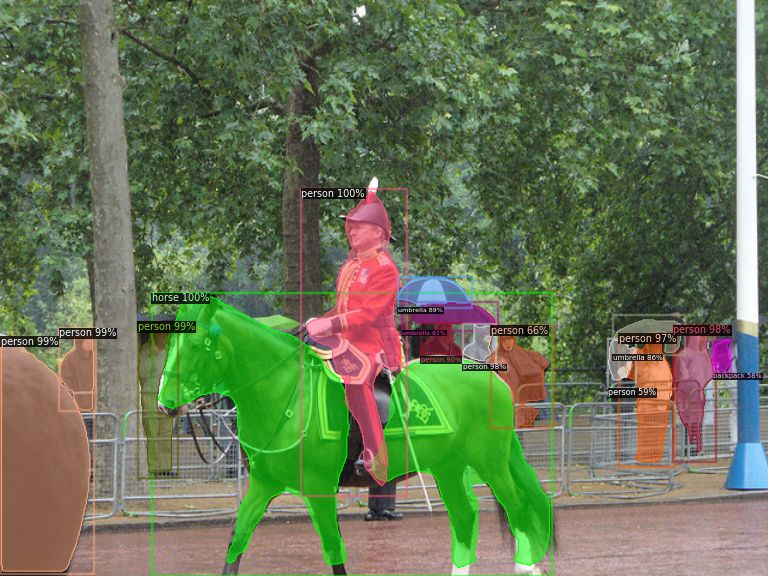

# Instance Image Segmentation with detectron2

This small tutorial is targeted at researchers that have basic machine learning and Python programming skills that want to implement instance image segmentation for further use in their models. detectron2 is still under heavy development and as of January 2020 usable with Windows without some code changes that are explained in [this chapter](#installation-windows). All software used is forked, so that there should be no API changes and this tutorial should continue to work as written. For training, a CUDA capable Nvidia GPU ist required, inferencing with a trained model can be done on CPU. If you do not have a local GPU available, you can also follow my tutorial on [Google Colab](https://colab.research.google.com/drive/1hxmdsLmqI6LR2v5SqHzH8oILXVI4eIzR).

## Table of Contents

- [Instance Image Segmentation with detectron2](#instance-image-segmentation-with-detectron2)
  - [Table of Contents](#table-of-contents)
  - [Requirements for this tutorial](#requirements-for-this-tutorial)
  - [Installation (Windows)](#installation-windows)
  - [Data Preparation](#data-preparation)
  - [Preparing the Dataset in Python](#preparing-the-dataset-in-python)
  - [Training the Model](#training-the-model)
  - [Inferencing on new Data](#inferencing-on-new-data)
  - [Inferencing on CPU](#inferencing-on-cpu)

## Requirements for this tutorial

- Windows installation
- Nvidia GPU
- Python 3
- if the requirements are not met:
  - detectron2 has a [similar tutorial](https://colab.research.google.com/drive/16jcaJoc6bCFAQ96jDe2HwtXj7BMD_-m5#scrollTo=8IRGo8d0qkgR) on Google Collab
  - Google Collab provides a Python programming environment with GPU support for free
- for inferencing with a trained model on new data, you can also use a CPU, see [Inferencing on CPU](#inferencing-on-cpu))

## Installation (Windows)

- install [Python 3](https://www.python.org/ftp/python/3.8.1/python-3.8.1.exe) and add it to PATH
- install [CUDA](https://docs.nvidia.com/cuda/cuda-installation-guide-microsoft-windows/index.html)
- install [git](https://git-scm.com/download/win) and add it to PATH
- clone this repository with
`git clone https://github.com/InformationSystemsFreiburg/imgage_segmentation_tokyo`
- install [Visual Studio Code Community Edition](https://visualstudio.microsoft.com/thank-you-downloading-visual-studio/?sku=Community&rel=16) to get the GCC compiler

```bash
# check in terminal if gcc is installed, if not, try restarting the computer
gcc --version
# move to the folder of the image_segmentation-tokyo repo
cd .\imgage_segmentation_tokyo\
# create a new Python virtualenvironment
pip install virtualenv
virtualenv detectron2-env
.\detectron2-env\Scripts\activate
# install the following Python packages
pip install numpy pandas tqdm matplotlib seaborn psutil cython opencv-python
pip install "git+https://github.com/MarkusRosen/fvcore"
pip install torch===1.3.1 torchvision===0.4.2 -f https://download.pytorch.org/whl/torch_stable.html
pip install "git+https://github.com/MarkusRosen/cocoapi.git#egg=pycocotools&subdirectory=PythonAPI"
```

- to check if the GPU is recognized within PyTorch, you can run the following code
- if the console output shows no GPU, you need to check your CUDA, Python and PyTorch installations

```python
from utils import check_gpu

check_gpu
```

Pytorch libraries have to be changed on Windows to work with `detectron2`

Location of first file:
`.\detectron2-env\Lib\site-packages\torch\include\torch\csrc\jit\argument_spec.h`

Search for

```C
static constexpr size_t DEPTH_LIMIT = 128;
```

change to →

```C
static const size_t DEPTH_LIMIT = 128;
```

Location of second file:
`.\detectron2-env\Lib\site-packages\torch\include\pybind11\cast.h`

Search for

```C
explicit operator type&() { return *(this->value); }
```

change to →

```C
explicit operator type&() { return *((type*)this->value); }
```

```bash
# clone this repository
git clone https://github.com/MarkusRosen/detectron2
# move into the detectron2 folder
cd detectron2
# build the package (this will take a few minutes)
python setup.py build develop
# restart terminal/editor
# check if installation was successful with the following code:
.\detectron2-env\Scripts\activate
python
>>> from detectron2.utils.logger import setup_logger
>>> setup_logger()
<Logger detectron2 (DEBUG)>
>>> exit()
```

To check if everything is working with the models, run the following code:


```python
import detectron2
from detectron2.utils.logger import setup_logger

setup_logger()

# import some common libraries
import numpy as np
import cv2
import random

# import some common detectron2 utilities
from detectron2 import model_zoo
from detectron2.engine import DefaultPredictor
from detectron2.config import get_cfg
from detectron2.utils.visualizer import Visualizer
from detectron2.data import MetadataCatalog

import matplotlib.pyplot as plt

im = cv2.imread("./input.jpg")
plt.imshow(im)
cfg = get_cfg()
# you can choose alternative models as backbone here
cfg.merge_from_file(
    "./detectron2/detectron2/model_zoo/configs/COCO-InstanceSegmentation/mask_rcnn_R_50_FPN_3x.yaml"
)

cfg.MODEL.ROI_HEADS.SCORE_THRESH_TEST = 0.5
# if you changed the model above, you need to adapt the following line as well
cfg.MODEL.WEIGHTS = "detectron2://COCO-InstanceSegmentation/mask_rcnn_R_50_FPN_3x/137849600/model_final_f10217.pkl"
predictor = DefaultPredictor(cfg)
outputs = predictor(im)
print(outputs["instances"].pred_classes)
print(outputs["instances"].pred_boxes)
v = Visualizer(im[:, :, ::-1], MetadataCatalog.get(cfg.DATASETS.TRAIN[0]), scale=1.2)
v = v.draw_instance_predictions(outputs["instances"].to("cpu"))
plt.imshow(v.get_image()[:, :, ::-1])
# save image
plt.savefig("output.jpg")
```

The `output.jpg` should look like this:


## Data Preparation

- Create a folder named `buildings`
- within this folder, create two folders: `val` and `train`
- Open the `VGG Annotator` and open the HTML file in the browser:
- Short introductions on how to use the tool:
  - Go to settings and specify the default path to where your train folder is located, example: `../data/buildings/train/` 
  - create a new attributes called `class`
  - set this attribute to `checkbox`
  - add `building` and `window` as options to `class`
- save the project
- copy images to the `train` and `val` folders
- import the images to the `VGG Annotator`
- zoom into the image with `CTRL` + `Mousewheel`
- select the `polygon region shape` tool and start with marking the `windows`
- after a polygon is finished, press `s` to save it
- after all `window` polygons are created, create the `building` polygons
- press `Spacebar` to open the annotations
- specify the correct `class` to each polygon
- after an image is done, save the project
- after all images are done, export the annotations to `train` as .json files and rename them to `via_region_data.json`
- do all of the above steps also for the validation data

## Preparing the Dataset in Python

```python

from detectron2.structures import BoxMode
from detectron2.utils.visualizer import Visualizer
from detectron2.engine import DefaultPredictor
from detectron2.data import DatasetCatalog, MetadataCatalog
from detectron2.utils.visualizer import ColorMode
from detectron2.engine import DefaultTrainer
from detectron2.config import get_cfg
from detectron2 import model_zoo

import os
import numpy as np
import json
import matplotlib.pyplot as plt
import cv2
import random
from datetime import datetime

def get_building_dicts(img_dir):
    """This function loads the JSON file created with the annotator and converts it to 
    the detectron2 metadata specifications.
    """
    # load the JSON file
    json_file = os.path.join(img_dir, "via_region_data.json")
    with open(json_file) as f:
        imgs_anns = json.load(f)

    dataset_dicts = []
    # loop through the entries in the JSON file
    for idx, v in enumerate(imgs_anns.values()):
        record = {}
        # add file_name, image_id, height and width information to the records
        filename = os.path.join(img_dir, v["filename"])
        height, width = cv2.imread(filename).shape[:2]

        record["file_name"] = filename
        record["image_id"] = idx
        record["height"] = height
        record["width"] = width

        annos = v["regions"]

        objs = []
        # one image can have multiple annotations, therefore this loop is needed
        for annotation in annos:
            # reformat the polygon information to fit the specifications
            anno = annotation["shape_attributes"]
            px = anno["all_points_x"]
            py = anno["all_points_y"]
            poly = [(x + 0.5, y + 0.5) for x, y in zip(px, py)]
            poly = [p for x in poly for p in x]
  
            region_attributes = annotation["region_attributes"]["class"]
            # specify the category_id to match with the class. 

            elif "building" in region_attributes:
                category_id = 1
            elif "window" in region_attributes:
                category_id = 0

            obj = {
                "bbox": [np.min(px), np.min(py), np.max(px), np.max(py)],
                "bbox_mode": BoxMode.XYXY_ABS,
                "segmentation": [poly],
                "category_id": category_id,
                "iscrowd": 0,
            }
            objs.append(obj)
        record["annotations"] = objs
        dataset_dicts.append(record)

    return dataset_dicts
```

- On Windows, all PyTorch code needs to be run within `if __name__ == '__main__':`
- load the data and draw a few input images to check if the annotations are correct:

```python
if __name__ == "__main__":
    # the data has to be registered within detectron2, once for the train and once for
    # the val data
    for d in ["train", "val"]:
        DatasetCatalog.register(
            "buildings_" + d,
            lambda d=d: get_building_dicts("./via-2.0.8/buildings/" + d),
        )
        
    building_metadata = MetadataCatalog.get("buildings_train")

    dataset_dicts = get_building_dicts("./via-2.0.8/buildings/train")

    for i, d in enumerate(random.sample(dataset_dicts, 5)):
        img = cv2.imread(d["file_name"])
        visualizer = Visualizer(img[:, :, ::-1], metadata=building_metadata, scale=0.5)
        vis = visualizer.draw_dataset_dict(d)

        plt.imshow(vis.get_image()[:, :, ::-1])
        # the folder inputs has to be created first
        plt.savefig(f"./inputs/input_{i}.jpg")
```

## Training the Model

- depending on the data size, the hardware used and the amount of iterations, the training can take a few minutes to a few hours.

```python
    cfg = get_cfg()
    # you can choose alternative models as backbone here
    cfg.merge_from_file(
        "./detectron2/detectron2/model_zoo/configs/COCO-InstanceSegmentation/mask_rcnn_R_50_FPN_3x.yaml"
    )

    cfg.DATASETS.TRAIN = ("buildings_train",)
    cfg.DATASETS.TEST = ()
    cfg.DATALOADER.NUM_WORKERS = 2
    # if you changed the model above, you need to adapt the following line as well
    cfg.MODEL.WEIGHTS = model_zoo.get_checkpoint_url(
        "COCO-InstanceSegmentation/mask_rcnn_R_50_FPN_3x.yaml"
    )  # Let training initialize from model zoo
    cfg.SOLVER.IMS_PER_BATCH = 2
    cfg.SOLVER.BASE_LR = 0.00025  # pick a good LR, 0.00025 seems a good start
    cfg.SOLVER.MAX_ITER = 5000  # 300 iterations is a good start, for better accuracy increase this value
    cfg.MODEL.ROI_HEADS.BATCH_SIZE_PER_IMAGE = (
        512  # (default: 512), select smaller if faster training is needed
    )
    cfg.MODEL.ROI_HEADS.NUM_CLASSES = 2  # for the two classes window and building
    start = datetime.now()
    # for inferencing, the following 4 lines of code should be commented out
    
    os.makedirs(cfg.OUTPUT_DIR, exist_ok=True)
    trainer = DefaultTrainer(cfg)
    trainer.resume_or_load(resume=False)
    trainer.train()
    print("Time needed for training:", datetime.now() - start)
```

## Inferencing on new Data

- the trained model is save in `/output/model_final.pth` and can now be loaded for inferencing. 
- compared to training, inferencing should be very fast.

```python
    # load the trained weights from the output folder
    cfg.MODEL.WEIGHTS = os.path.join(cfg.OUTPUT_DIR, "model_final.pth")
    cfg.MODEL.ROI_HEADS.SCORE_THRESH_TEST = (
        0.50  # set the testing threshold for this model
    )
    cfg.DATASETS.TEST = ("buildings_val",)
    predictor = DefaultPredictor(cfg)
    
    # load the validation data
    dataset_dicts = get_building_dicts("./via-2.0.8/buildings/val")
    # save the results of the validation predictions as pictures in the ouputs folder
    for i, dataset in enumerate(dataset_dicts):
 
        im = cv2.imread(dataset["file_name"])
        outputs = predictor(im)

        v = Visualizer(
            im[:, :, ::-1],
            metadata=building_metadata,
            scale=0.8,
            instance_mode=ColorMode.IMAGE_BW,  # remove the colors of unsegmented pixels
        )

        v = v.draw_instance_predictions(outputs["instances"].to("cpu"))
        plt.imshow(v.get_image()[:, :, ::-1])
        # the outputs folder has to be created before running this line
        plt.savefig(f"./outputs/output_{i}.jpg")
```

## Inferencing on CPU

- Inferencing on the CPU is possible by setting `cfg.MODEL.DEVICE = "cpu"` 
- CPU inferencing will be a lot slower than on GPU (on my device 8x slower)

```python
    # set device to CPU
    cfg.MODEL.DEVICE = "cpu"
    # load the trained weights from the output folder
    
    cfg.MODEL.WEIGHTS = os.path.join(cfg.OUTPUT_DIR, "model_final.pth")
    cfg.MODEL.ROI_HEADS.SCORE_THRESH_TEST = (
        0.70  # set the testing threshold for this model
    )

    # load the validation data
    cfg.DATASETS.TEST = ("buildings_val",)
    # create a predictor
    predictor = DefaultPredictor(cfg)

    print("Time needed for training:", datetime.now() - start)
    start = datetime.now()
    dataset_dicts = get_building_dicts("./via-2.0.8/buildings/val")
    # save the results of the validation predictions as pictures in the ouputs folder
    for i, dataset in enumerate(dataset_dicts):

        im = cv2.imread(dataset["file_name"])
        outputs = predictor(im)

        v = Visualizer(
            im[:, :, ::-1],
            metadata=building_metadata,
            scale=0.8,
            instance_mode=ColorMode.IMAGE_BW,  # remove the colors of unsegmented pixels
        )

        v = v.draw_instance_predictions(outputs["instances"].to("cpu"))
        plt.imshow(v.get_image()[:, :, ::-1])
        plt.savefig(f"./outputs/output_{i}.jpg")
    print("Time needed for inferencing:", datetime.now() - start)
```